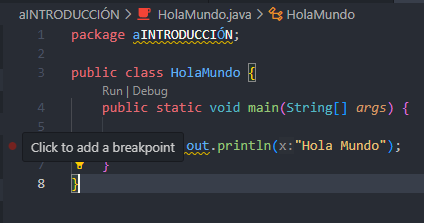

## 1. Definiciones Básicas

# BreakPoints
Los breakpoints son puntos de interrupción que puedes establecer en tu código cuando depuras (debugging).
Permiten pausar la ejecución del programa en un punto específico y analizar variables, memoria y flujo de ejecución.

💡 Ejemplo de uso en código Java:


<details>
  <summary>📌 Ver diagrama</summary>

  

</details>


# Lenguaje de Alto Nivel
Un lenguaje de alto nivel es un lenguaje de programación diseñado para ser fácil de leer y escribir por los humanos. Se abstrae de los detalles específicos del hardware, permitiendo escribir código sin preocuparse por la gestión de memoria o la arquitectura del procesador.

**💡 Ejemplo:**
```java
System.out.println("Hola, mundo!"); // Imprime texto en la consola
```


# Lenguaje Orientado a Objetos
Un lenguaje orientado a objetos (OOP) organiza el código en "objetos", que combinan datos (atributos) y comportamientos (métodos). Java sigue este paradigma, permitiendo modelar elementos del mundo real como clases y objetos.

**💡 Ejemplo:**
```java
class Persona {
    String nombre;
    
    void saludar() {
        System.out.println("Hola, mi nombre es " + nombre);
    }
}
```


# Compilar
Compilar es el proceso de convertir el código fuente **(.java)** en un código intermedio llamado bytecode **(.class)**, que puede ser ejecutado por la Java Virtual Machine **(JVM)**.

**💡 Comando en la terminal:**
```sh
javac MiPrograma.java  # Compila el código fuente a bytecode
```


# Ejecutar
Ejecutar un programa en Java significa correr el bytecode **(.class)** dentro de la **JVM**, que lo traduce a instrucciones que el sistema operativo pueda entender.

**💡 Comando en la terminal:**
```sh
java MiPrograma  # Ejecuta el programa
```


# Debuguear
Debuguear es el proceso de encontrar y corregir errores en el código. Se pueden usar herramientas como **IntelliJ IDEA** o **VS Code** para poner breakpoints y analizar el flujo del programa en tiempo de ejecución.

**💡 Ejemplo de depuración con un breakpoint:**
```java
int x = 10;
System.out.println(x); // Aquí puedes poner un breakpoint y analizar el valor de x
```

---

## 2. JDK ImplementsS


# Java Language Specification (_JLS_)
El **JLS** define las reglas y la sintaxis del lenguaje Java. Es la documentación oficial que describe cómo debe comportarse el lenguaje, incluyendo estructuras de control, tipos de datos, clases y excepciones.

**💡 Ejemplo de una regla del JLS:**
- En Java, los nombres de clases deben empezar con una letra mayúscula.

```java
class MiClase { }  // Correcto  
class miClase { }  // Incorrecto según la convención
```

# Java Virtual Machine Specification (_JVMS_)
El **JVMS** define cómo la Java Virtual Machine **(JVM)** ejecuta el código **Java**. Especifica cómo el _bytecode_ es interpretado, optimizado y ejecutado en diferentes sistemas operativos.

**Ejemplo:**
La _JVM_ maneja la recolección de basura (Garbage Collection) automáticamente para liberar memoria.

```java
MiClase obj = new MiClase();
obj = null;  // La JVM liberará esta memoria en algún momento
```

# Standar Edition (_SE_) of Java Application Programming (_API_)

El Java **SE API** es la colección de librerías estándar que proporciona funcionalidades esenciales para el desarrollo en Java. Incluye paquetes como:

📌 **java.lang** → _String, Math, System, Integer, Double_
📌 **java.util** → _List, Map, Collections_
📌 **java.io** → _Manejo de archivos_

**💡 Ejemplo de uso del API estándar:**
```java
import java.util.ArrayList;

public class EjemploAPI {
    public static void main(String[] args) {
        ArrayList<String> lista = new ArrayList<>();
        lista.add("Java");
        lista.add("Spring Boot");

        System.out.println(lista); // [Java, Spring Boot]
    }
}
```